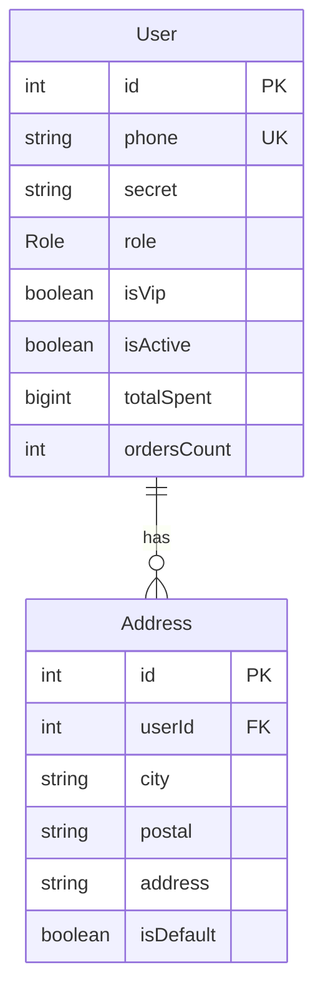
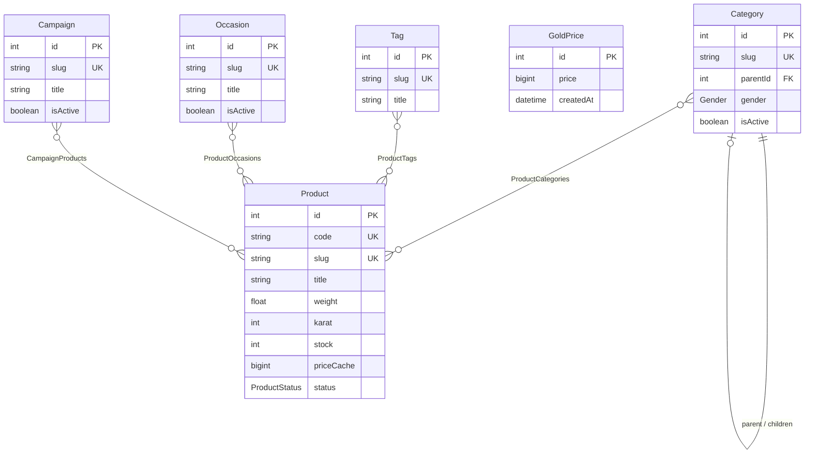
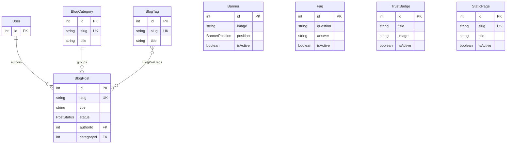
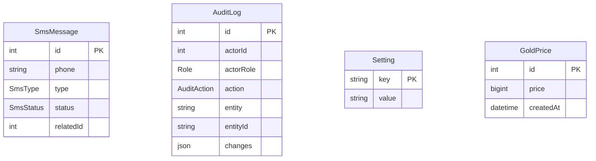
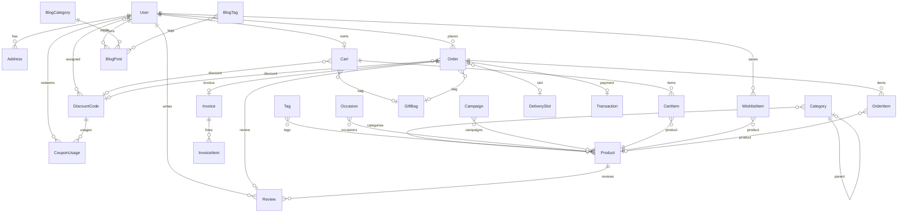

# Database Schema

Entity-relationship diagrams for the pland PostgreSQL database, generated from [`prisma/schema.prisma`](../prisma/schema.prisma).

Prisma creates implicit join tables for many-to-many relations (e.g. `_ProductCategories`, `_DiscountAssignedUsers`).

---

## Users & Auth



---

## Catalog



---

## Cart & Wishlist

```mermaid
erDiagram
    User {
        int id PK
    }

    Cart {
        int id PK
        int userId FK UK
        int giftBagId FK
        int discountCodeId FK
    }

    CartItem {
        int id PK
        int cartId FK
        int productId FK
        int quantity
    }

    WishlistItem {
        int id PK
        int userId FK
        int productId FK
    }

    Product {
        int id PK
    }

    GiftBag {
        int id PK
        GiftBagType type
        string title
        bigint price
        int stock
    }

    DiscountCode {
        int id PK
        string code UK
        DiscountType type
        DiscountTarget target
    }

    User ||--o| Cart : owns
    Cart ||--o{ CartItem : contains
    CartItem }o--|| Product : references
    Cart }o--o| GiftBag : "optional bag"
    Cart }o--o| DiscountCode : "applied code"

    User ||--o{ WishlistItem : saves
    WishlistItem }o--|| Product : references
```

---

## Orders & Payments

```mermaid
erDiagram
    User {
        int id PK
    }

    Order {
        int id PK
        string orderNumber UK
        int userId FK
        OrderStatus status
        bigint itemsTotal
        bigint total
        int deliverySlotId FK
        int giftBagId FK
        int discountCodeId FK
    }

    OrderItem {
        int id PK
        int orderId FK
        int productId FK
        string title
        float weight
        bigint price
        int quantity
    }

    DeliverySlot {
        int id PK
        datetime date
        string fromHour
        string toHour
        int capacity
        boolean isActive
    }

    Transaction {
        int id PK
        int orderId FK UK
        PaymentMethod method
        PaymentStatus status
        bigint amount
    }

    Invoice {
        int id PK
        int orderId FK UK
        string invoiceNumber UK
        bigint total
    }

    InvoiceItem {
        int id PK
        int invoiceId FK
        string title
        float weight
        bigint total
    }

    GiftBag {
        int id PK
    }

    DiscountCode {
        int id PK
    }

    Product {
        int id PK
    }

    User ||--o{ Order : places
    Order ||--o{ OrderItem : contains
    OrderItem }o--o| Product : "snapshot ref"
    Order }o--o| DeliverySlot : "scheduled in"
    Order }o--o| GiftBag : "gift bag snapshot"
    Order }o--o| DiscountCode : "discount applied"
    Order ||--o| Transaction : "payment"
    Order ||--o| Invoice : "billing"
    Invoice ||--o{ InvoiceItem : lines
```

---

## Reviews & Discounts

```mermaid
erDiagram
    User {
        int id PK
    }

    Product {
        int id PK
    }

    Order {
        int id PK
    }

    Review {
        int id PK
        int userId FK
        int productId FK
        int orderId FK UK
        int rating
        ReviewStatus status
    }

    DiscountCode {
        int id PK
        string code UK
        DiscountType type
        int usageLimit
        boolean isActive
    }

    CouponUsage {
        int id PK
        int codeId FK
        int userId FK
        int orderId
    }

    User ||--o{ Review : writes
    Product ||--o{ Review : receives
    Order ||--o| Review : "optional review"

    User }o--o{ DiscountCode : "assigned users"
    DiscountCode ||--o{ CouponUsage : tracked
    User ||--o{ CouponUsage : redeems
    DiscountCode ||--o{ Order : "used on orders"
```

---

## CMS & Blog



---

## System & Logs

Standalone tables with no foreign-key relations defined in Prisma:



`AuditLog.actorId` and `SmsMessage.relatedId` are stored as plain integers (no FK constraints).

---

## Full overview

High-level map of all related tables:



---

## Enums

| Enum | Values |
|------|--------|
| `Role` | USER, ADMIN |
| `Gender` | MALE, FEMALE, KIDS, UNISEX |
| `ProductStatus` | DRAFT, AVAILABLE, UNAVAILABLE, RESERVED, SOLD, INACTIVE |
| `OrderStatus` | PENDING, PAID, PROCESSING, SHIPPED, DELIVERED, COMPLETED, CANCELED, FAILED |
| `PaymentMethod` | ONLINE, MANUAL |
| `PaymentStatus` | PENDING, PAID, REJECTED, REFUNDED |
| `ShippingMethod` | COURIER, POST, TIPAX |
| `GiftBagType` | NORMAL, WOODEN, VIP, OCCASION |
| `DiscountType` | PERCENT, FIXED |
| `DiscountTarget` | ALL, VIP, INACTIVE, SPECIFIC |
| `BannerPosition` | HOME_SLIDER, AD_BANNER |
| `ReviewStatus` | PENDING, APPROVED, REJECTED |
| `PostStatus` | DRAFT, PUBLISHED |
| `SmsType` | OTP, ORDER, PAYMENT, SHIPPING, DELIVERY, DISCOUNT, PROMO |
| `SmsStatus` | PENDING, SENT, FAILED |
| `AuditAction` | CREATE, UPDATE, DELETE, STATUS_CHANGE, LOGIN, LOGOUT |
